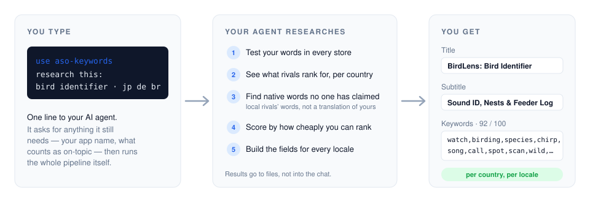
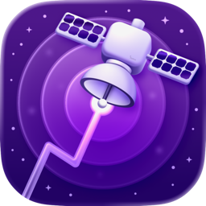
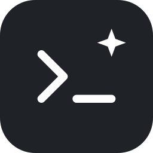
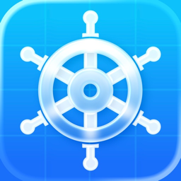
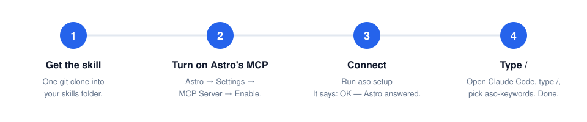
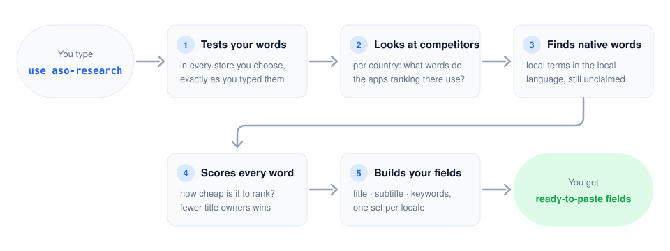

<div align="center">

# ASO Research

**Find App Store keywords in every country's own language — the ones nobody has claimed yet — by asking your AI coding agent.**


<picture>
  <source media="(prefers-color-scheme: dark)" srcset="docs/how-it-works-dark.svg">
  
</picture>

</div>

<br>

## What do you need?

<table>
<tr>
<td align="center" width="33%" valign="top">
<a href="https://tryastro.app?aff=ZykvL2" target="_blank" rel="noopener"></a><br><br>
<a href="https://tryastro.app?aff=ZykvL2" target="_blank" rel="noopener"><b>Astro</b></a><br>
<br><br>
<b>The data.</b><br>
Keyword popularity, difficulty, and who ranks where — in every country's store. This is the one thing you must have. Mac app, macOS 14 or newer.<br><br>
<a href="https://tryastro.app?aff=ZykvL2" target="_blank" rel="noopener"></a>
</td>
<td align="center" width="33%" valign="top">
<br><br>
<b>An AI coding agent</b><br>
<br><br>
<b>Where you type.</b><br>
Claude Code, Codex, Cursor, Gemini CLI, GitHub Copilot, OpenCode, Windsurf, Zed — any agent that supports <a href="https://agentskills.io" target="_blank" rel="noopener">Agent Skills</a>. Over 70 do.<br><br>

</td>
<td align="center" width="33%" valign="top">
<a href="https://helm-app.com" target="_blank" rel="noopener"></a><br><br>
<a href="https://helm-app.com" target="_blank" rel="noopener"><b>Helm</b></a><br>
<br><br>
<b>The publisher.</b><br>
Connects to App Store Connect, so your agent can read your live listing and publish the new fields. Without it, you copy and paste.<br><br>
<a href="https://helm-app.com" target="_blank" rel="noopener"></a>
</td>
</tr>
</table>

> **Mac only.** Astro runs only on macOS, and the tool needs Astro. Python is also needed — every Mac already has it.

<br>

## Contents

1. [Set up — 4 steps](#1-set-up--4-steps)
2. [Use it](#2-use-it)
3. [What your agent does](#3-what-your-agent-does)
4. [Publishing](#4-publishing)
5. [Help](#5-help)
6. [For developers](#6-for-developers)

<br>

## 1. Set up — 4 steps

<picture>
  <source media="(prefers-color-scheme: dark)" srcset="docs/setup-steps-dark.svg">
  
</picture>

### Step 1 · Get the skill

Open **Terminal** and paste:

```bash
npx skills add mokhselim/ASO-Research-Skill
```

It detects which agent you use and installs the skill in the right place. Nothing else to install.

<details>
<summary>Choose the agent yourself, or install without npx</summary>

<br>

Pick an agent explicitly:

```bash
npx skills add mokhselim/ASO-Research-Skill --agent claude-code
npx skills add mokhselim/ASO-Research-Skill --agent codex
npx skills add mokhselim/ASO-Research-Skill --agent cursor
```

Any name from `npx skills add --help` works — `gemini-cli`, `github-copilot`, `opencode`, `windsurf`, `zed`, and about 65 more.

No Node? For Claude Code you can clone straight into its skills folder:

```bash
git clone https://github.com/mokhselim/ASO-Research-Skill.git ~/.claude/skills/aso-research
```

</details>

### Step 2 · Turn on Astro's MCP server

Open <a href="https://tryastro.app?aff=ZykvL2" target="_blank" rel="noopener"><b>Astro</b></a> → **Settings** → **MCP Server** → turn on **Enable MCP Server**.

Keep Astro open while you work — the tool talks to it.

### Step 3 · Connect

Ask your agent:

```
set up aso-research
```

It runs the connection check for you and reports back. You want to see:

```
OK — Astro answered, N app(s) in its workspace. You're set up.
```

Once is enough — it remembers.

<details>
<summary>Prefer to run it yourself?</summary>

<br>

```bash
python3 <skill folder>/bin/aso setup
```

where `<skill folder>` is where Step 1 put it — `~/.claude/skills/aso-research` for Claude Code, `~/.agents/skills/aso-research` for Codex, or whatever path `npx skills add` printed.

</details>

### Step 4 · Ask your agent

Say **use aso-research** and what your app does. Done — see the next section for the exact words per agent.

<br>

## 2. Use it

Tell your agent what your app does and which countries matter. The wording differs slightly per agent:

| Agent | What you type |
|:--|:--|
| **Claude Code** | `/aso-research research this: bird identifier, bird sound id — for jp, de, br` |
| **Codex** | `$aso-research research this: bird identifier, bird sound id — for jp, de, br` |
| **Any other agent** | `Use the aso-research skill. Research this: bird identifier, bird sound id — for jp, de, br` |

Most agents also pick the skill up on their own when you simply ask for App Store keyword research — the explicit name just makes sure.

That's the whole interface. Name the countries you care about, or leave it to the agent.

**What the conversation looks like.** Before it runs anything, the agent checks Astro is reachable, then asks for three things — your app, one line on what it does, your seed words — and follows up with a few pick-an-option questions (countries, live listing, depth; you can always type your own answer). Then it shows you a short research plan and waits for your go. After each country it posts a **store card** (what it found, what died, what needs your call), and it never ends with a bare "done": you get a **session summary** that lists which countries are finished, which are half-done, and which were never touched, plus a progress board so you can pick up exactly where it stopped:

```
  store pool  compet  locals  mine  relat  rank  fill          state
  us    ●     ●       –       ●     ●      ●     en-US         fields built
  jp    ●     ●       ●       ●     ●      ●     ja            fields built  ← target
  de    ●     ●       ·       ·     ·      ·     ·             in progress (2/7)  ← target
  br    ·     ·       ·       ·     ·      ·     ·             NOT STARTED  ← target
```

To continue later, just say `continue with de` — the agent reads the board first.

Other things you can ask:

```
which countries should I localise into?
write me a Japanese title and subtitle
check my current keywords — here is my live listing
where are we?  /  continue with br
```

<br>

## 3. What your agent does

<picture>
  <source media="(prefers-color-scheme: dark)" srcset="docs/what-claude-does-dark.svg">
  
</picture>

| | |
|:--|:--|
| **1 · Tests your words** | In every store you chose, exactly as you typed them, for real search popularity. |
| **2 · Looks at competitors** | Per country: what words do the apps ranking there actually use? |
| **3 · Finds native words** | The big one. In each country your agent reads the local apps that rank — the ones global apps never noticed — and tests *their* words in the local language. People in Japan or Brazil don't search a translation of your keyword; they search a different word. Many of those words have no one in their title yet. That's the gap. |
| **4 · Scores every word** | How cheap is it to rank for? A native word with nobody in their title beats a popular word everyone already owns. |
| **5 · Builds your fields** | Title, subtitle, keywords — one set per locale. If you have a live listing, you see OLD vs NEW and a warning if the new one is worse. |

Results are saved as files in `projects/<your-app>/`, not printed into the chat.

<br>

## 4. Publishing

**With Helm** — your agent reads your live listing for the OLD vs NEW check, and can publish the finished fields to App Store Connect.

**Without Helm** — copy the fields into App Store Connect by hand. **Replace** your keyword field; don't add to it.

<br>

## 5. Help

| You see | Do this |
|:--|:--|
| The agent doesn't know the skill | Start a **new** session — skills load at the start. If it still doesn't, run Step 1 again with `--agent <your agent>`. |
| `astro unreachable … is Astro running?` | Open <a href="https://tryastro.app?aff=ZykvL2" target="_blank" rel="noopener">Astro</a>. Check **Settings → MCP Server** is on. Run Step 3 again. |
| `astro unreachable` but Astro **is** running | Your agent is sandboxing commands with the network off. Approve the command or allow network access for it — Astro is on `localhost`, but a sandbox can still block it. |
| Astro shows an address other than `http://127.0.0.1:8089/mcp` | Ask your agent to run `aso setup --astro-url <the address Astro shows>` |
| `Astro is not configured` | Step 3 was skipped. Run it. |
| `python3: command not found` | macOS offers to install developer tools — click **Install**, then run Step 3 again. |
| A command is slow or times out | Ask your agent to run `aso setup --timeout 180` |

<br>

## 6. For developers

<details>
<summary>How it works, the CLI, config and rule files</summary>

<br>

**Why it works with any agent.** The skill is a plain-English `SKILL.md` (the <a href="https://agentskills.io" target="_blank" rel="noopener">Agent Skills</a> format) plus a Python CLI. The CLI talks to Astro itself, over plain HTTP on localhost — it never asks the agent's MCP client to do it. So the agent needs no MCP support at all, only the ability to run a shell command. The same files install into every agent unchanged.

**Trust.** Standard library only, no dependencies. The only network traffic is to your own Astro on `localhost`. Nothing is sent anywhere else, nothing is read from your keychain, no telemetry. Read `bin/core.py` — it's short.

**The CLI** — `bin/aso`, one command per stage:

```bash
cd <skill folder>
python3 bin/aso init birdlens --create --name "BirdLens (research)" \
    --seeds "bird identifier,bird sound id" \
    --relevance "bird,birding,vogel,oiseau,野鳥,새" \
    --category "bird,nature,wildlife" --stores "jp,de,br"
python3 bin/aso seed birdlens
python3 bin/aso localwinners birdlens --store jp
python3 bin/aso rank birdlens --store jp --locale ja
python3 bin/aso fill birdlens --store jp --locale ja --name "..." --subtitle "..."
```

| command | what it does |
|:--|:--|
| `setup [--astro-url …] [--timeout …]` | save your Astro address and test it (tries Astro's default if none given) |
| `init <slug>` | new project (`--create` also makes the Astro app — permanent, no delete tool; `--stores` records the countries you want tracked) |
| `seed <slug>` | push seeds into the `us` store, show what survives |
| `expand <slug> --stores cc,…` | pull per-store pools, read-only |
| `competitors <slug> --store cc` | top-5 apps per seed; flags local-only rivals |
| `mine <slug> --store cc` | harvest the vocabulary of ranking apps |
| `related <slug> --store cc` | keyword suggestions for the seeds |
| `localwinners <slug> --store cc` | rivals that rank here but not in the US, plus their words |
| `verify <slug> --terms "…"` | test proposed native terms against real popularity (≤5 is dead) |
| `rank <slug> --store cc --locale l` | title-gap scoring plus trap flags |
| `exclude <slug> --terms … --why …` | record a rejection permanently |
| `fill <slug> …` | build the fields, with OLD vs NEW |
| `check <slug> --keywords …` | validate a hand-written field |
| `audit <slug> --live file.json` | audit live metadata: waste, violations, ADD/SWAP |
| `clean <slug> --store cc` | purge irrelevant terms from a pool (destructive, gated) |
| `status <slug> [--stores cc,…]` | project dashboard and the per-store progress board (done / in progress / NOT STARTED) |

Scoring: `popularity ÷ difficulty × (10 − title_owners)/10`.

**Per-project config** — `projects/<slug>/config.json`

| key | meaning |
|:--|:--|
| `relevance_stems` | **required** — what counts as on-topic. Without it the filter refuses to run rather than guess. |
| `app_terms` | exact-match feature words (`offline`, `ai`) |
| `allow_terms` | un-blocks a blocklist entry, paired to your category |
| `category_words` | used for the top-5 trap check |
| `filler_brands` | rival products of the same category |
| `target_stores` | the countries you asked for — the progress board reports each one |
| `astro_app` / `asc_app` | backend app id, and your App Store Connect id |

**Shared rule files** — `rules/`. `brands.txt`, `wrong-intent.txt`, `traps.txt` and `relevance.txt` ship **empty on purpose**: they hold category-specific calls, and a word that's off-topic for one app is the core term for another. An empty file means "no rule".

**Astro address** — saved by `setup` in `astro.json` next to the skill (gitignored), or set `ASTRO_URL` / `ASTRO_TIMEOUT` in the environment.

**The keyword field is single words with no overlap** against title and subtitle — Apple combines all three fields and forms the phrases for you ([worked example](rules/keyword-field-construction.md)).

</details>

<br>

<div align="center">

MIT licensed — see [LICENSE](LICENSE)

</div>
