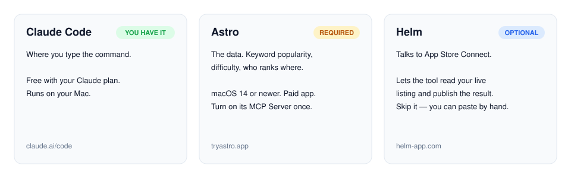

# ASO Research

Find the right App Store keywords for your app — in every country — by typing one line in
Claude Code.

<picture>
  <source media="(prefers-color-scheme: dark)" srcset="docs/how-it-works-dark.svg">
  
</picture>

---

## What you need

<picture>
  <source media="(prefers-color-scheme: dark)" srcset="docs/what-you-need-dark.svg">
  
</picture>

| | | |
|---|---|---|
| **Claude Code** | You have it | This is where you type. |
| **Astro** | **Required** | The data. Without it, the tool has no numbers. Mac only (macOS 14 or newer), paid. Get it at [tryastro.app](https://tryastro.app). |
| **Helm** | Optional | Connects to App Store Connect. With it, the tool can read your live listing and publish the result for you. Without it, you copy and paste. [helm-app.com](https://helm-app.com) |

**In short: you need a Mac with Astro on it.** Python is also needed, but every Mac already
has it.

---

## Set up (4 steps)

<picture>
  <source media="(prefers-color-scheme: dark)" srcset="docs/setup-steps-dark.svg">
  
</picture>

### 1. Get the skill

Open **Terminal** and paste this:

```bash
git clone https://github.com/mokhselim/ASO-Research-Skill.git ~/.claude/skills/aso-keywords
```

That puts the skill where Claude Code looks for skills. Nothing else to install.

### 2. Turn on Astro's MCP server

Open **Astro**. Go to **Settings → MCP Server**. Turn on **Enable MCP Server**. Leave Astro
open — the tool talks to it while you work.

### 3. Connect

Back in Terminal:

```bash
python3 ~/.claude/skills/aso-keywords/bin/aso setup
```

You should see:

```
OK — Astro answered, N app(s) in its workspace. You're set up.
```

You only do this once.

### 4. Type `/`

Open **Claude Code**. Start a new session. Type `/` and pick **aso-keywords**. Done.

<details>
<summary>Something didn't work?</summary>

| You see | Do this |
|---|---|
| `aso-keywords` is not in the `/` list | Start a **new** Claude Code session — skills load at the start. Check the folder is `~/.claude/skills/aso-keywords`. |
| `astro unreachable … is Astro running?` | Open Astro. Check **Settings → MCP Server** is on. Run step 3 again. |
| Astro shows a different address than `http://127.0.0.1:8089/mcp` | Run `python3 ~/.claude/skills/aso-keywords/bin/aso setup --astro-url <the address Astro shows>` |
| `Astro is not configured` | Step 3 was skipped. Run it. |
| `python3: command not found` | macOS will offer to install developer tools — click **Install**. Then run step 3 again. |
| A command is slow or times out | Run `python3 ~/.claude/skills/aso-keywords/bin/aso setup --timeout 180` |

</details>

<details>
<summary>Windows or Linux?</summary>

The skill itself runs anywhere Python 3.8+ runs. But **Astro is Mac-only**, and the tool
needs Astro. On Windows the practical path is a Mac on your network running Astro, and
pointing the skill at it:

```powershell
git clone https://github.com/mokhselim/ASO-Research-Skill.git "$env:USERPROFILE\.claude\skills\aso-keywords"
python "$env:USERPROFILE\.claude\skills\aso-keywords\bin\aso" setup --astro-url http://<mac-ip>:8089/mcp
```

Install Python from [python.org](https://www.python.org/downloads/) first and tick
**Add python.exe to PATH**. Use Windows Terminal, not the old `cmd.exe`, so Japanese and
Korean keywords display correctly.

</details>

---

## Use it

Type `/`, pick **aso-keywords**, and say what your app does:

```
/aso-keywords research this: bird identifier, bird sound id
```

That's it. Claude asks you for anything it still needs — usually your app's name — then does
the research.

You can also ask things like:

```
/aso-keywords which countries should I localise into?
/aso-keywords write me a Japanese title and subtitle
/aso-keywords check my current keywords — here is my live listing
```

### What Claude does

<picture>
  <source media="(prefers-color-scheme: dark)" srcset="docs/what-claude-does-dark.svg">
  
</picture>

1. **Tests your words** — exactly as you typed them — for real search popularity.
2. **Looks at competitors** — what words do apps ranking for your terms use?
3. **Looks at each country.** This is the big one. Claude finds apps that rank in Japan or
   Brazil but *not* in the US, and tests *their* words. Other countries don't translate your
   keywords — they use different ones. This finds them.
4. **Scores every word** by how cheap it is to rank for. A word with fewer competitors in
   their titles beats a popular word everyone already owns.
5. **Builds the fields.** If you already have a live listing, Claude shows OLD vs NEW and
   warns you if the new one is worse.

Results are saved as files in `projects/<your-app>/`, not printed into the chat.

### Publishing

If you have **Helm**, Claude can read your live listing for the OLD vs NEW check and publish
the finished fields to App Store Connect. If not, copy the fields into App Store Connect by
hand — **replace** your keyword field, don't add to it.

---

<details>
<summary>For developers: the CLI, config and rule files</summary>

Everything above is a plain Python CLI, `bin/aso`, one command per stage.

```bash
cd ~/.claude/skills/aso-keywords
python3 bin/aso init birdlens --create --name "BirdLens (research)" \
    --seeds "bird identifier,bird sound id" \
    --relevance "bird,birding,vogel,oiseau,野鳥,새" \
    --category "bird,nature,wildlife"
python3 bin/aso seed birdlens
python3 bin/aso localwinners birdlens --store jp
python3 bin/aso rank birdlens --store jp --locale ja
python3 bin/aso fill birdlens --store jp --locale ja --name "..." --subtitle "..."
```

| command | what it does |
|---|---|
| `setup [--astro-url …] [--timeout …]` | save your Astro address and test it (tries Astro's default if none given) |
| `init <slug>` | new project (`--create` also makes the Astro app — permanent, no delete tool) |
| `seed <slug>` | push seeds into the `us` store, show what survives |
| `expand <slug> --stores cc,…` | pull per-store pools, read-only |
| `competitors <slug> --store cc` | top-5 apps per seed; flags local-only rivals |
| `mine <slug> --store cc` | harvest the vocabulary of ranking apps |
| `related <slug> --store cc` | keyword suggestions for the seeds |
| `localwinners <slug> --store cc` | rivals that rank here but not in the US, plus their words |
| `verify <slug> --terms "…"` | test proposed native terms against real popularity (≤5 is dead) |
| `rank <slug> --store cc --locale l` | title-gap scoring plus trap flags |
| `exclude <slug> --terms … --why …` | record a rejection permanently |
| `fill <slug> …` | build the fields, with OLD vs NEW |
| `check <slug> --keywords …` | validate a hand-written field |
| `audit <slug> --live file.json` | audit live metadata: waste, violations, ADD/SWAP |
| `clean <slug> --store cc` | purge irrelevant terms from a pool (destructive, gated) |
| `status <slug>` | project dashboard |

Scoring: `popularity ÷ difficulty × (10 − title_owners)/10`.

**Per-project config** — `projects/<slug>/config.json`:

| key | meaning |
|---|---|
| `relevance_stems` | **required** — what counts as on-topic. Without it the filter refuses to run rather than guess. |
| `app_terms` | exact-match feature words (`offline`, `ai`) |
| `allow_terms` | un-blocks a blocklist entry, paired to your category |
| `category_words` | used for the top-5 trap check |
| `filler_brands` | rival products of the same category |
| `astro_app` / `asc_app` | backend app id, and your App Store Connect id |

**Shared rule files** — `rules/`. `brands.txt`, `wrong-intent.txt`, `traps.txt` and
`relevance.txt` ship **empty on purpose**: they hold category-specific calls, and a word that's
off-topic for one app is the core term for another. An empty file means "no rule".

**Astro address** — saved by `setup` in `astro.json` next to the skill (gitignored), or set
`ASTRO_URL` / `ASTRO_TIMEOUT` in the environment.

**The keyword field is single words with no overlap** against title and subtitle — Apple
combines all three fields and forms the phrases for you
([worked example](rules/keyword-field-construction.md)).

</details>

---

MIT licensed — see [LICENSE](LICENSE).
